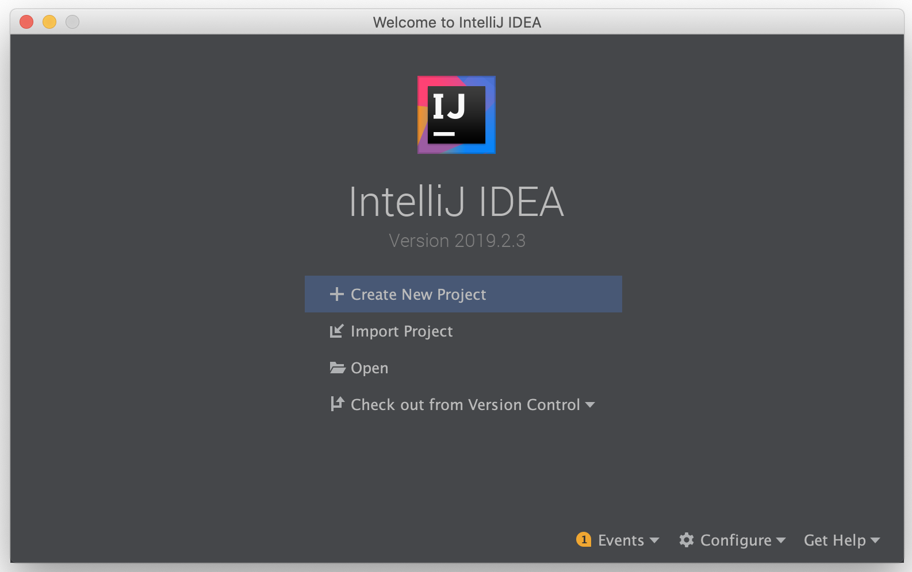
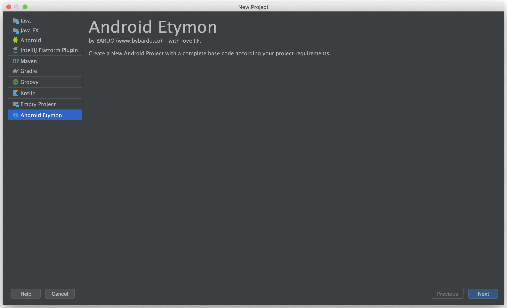
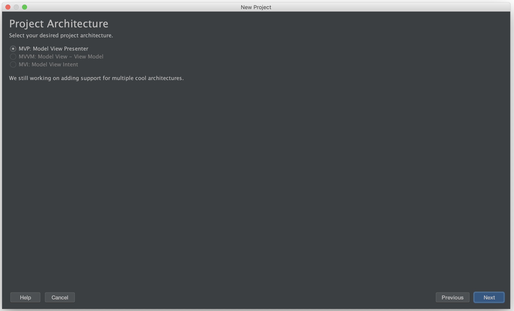
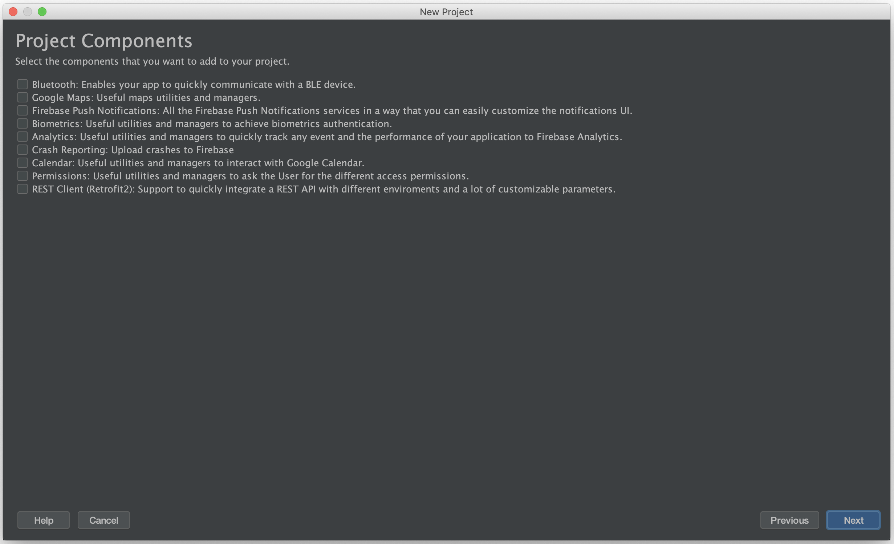
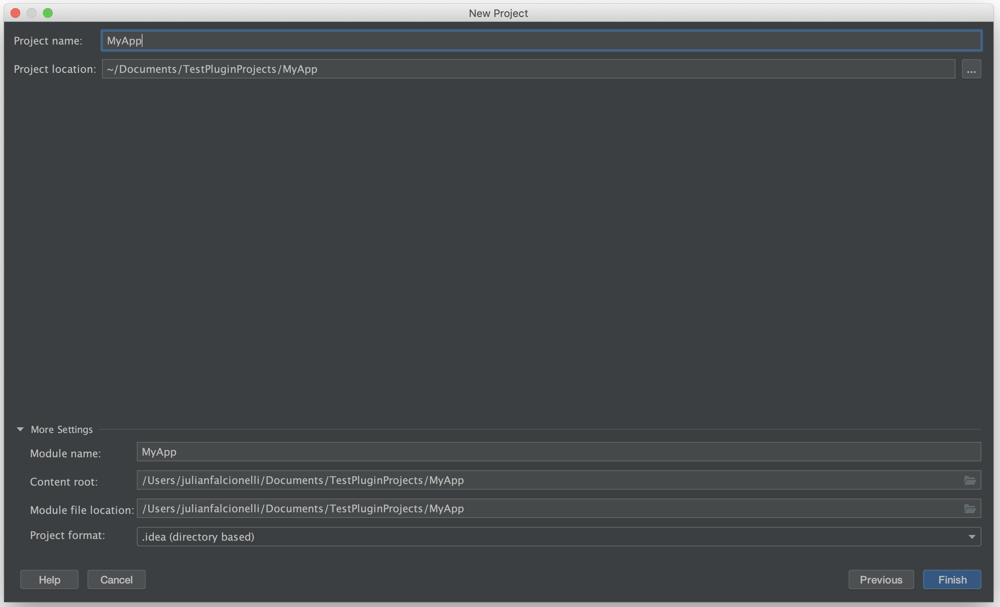
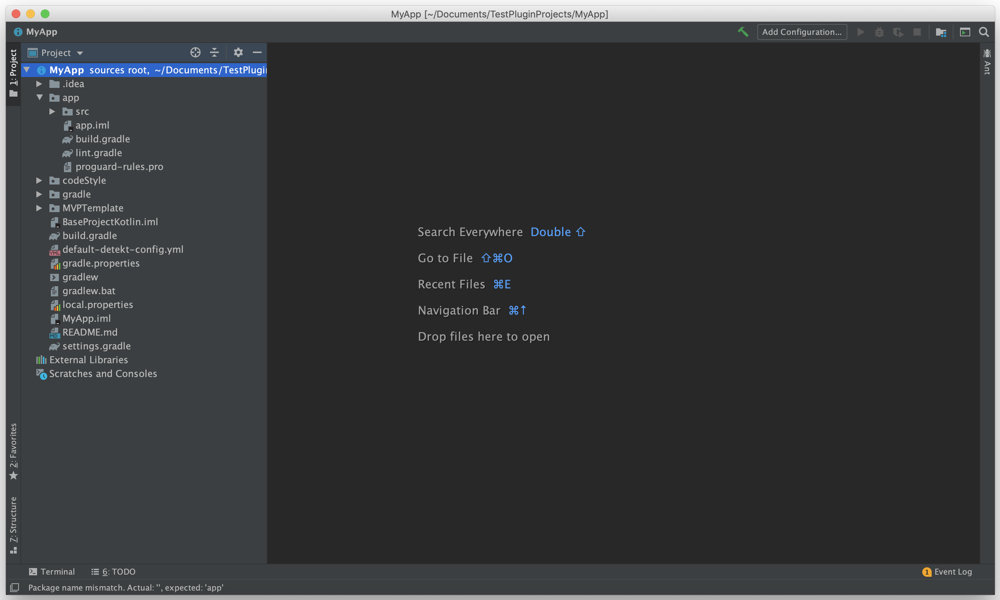

# Android Etymon Plugin Project Wizard (WIP)
Android Etymon helps Android Developers to start new Android Projects with a complete base code by selecting the project requirements from a list of components.

### List of supported components:
- Bluetooth: Enables your app to quickly communicate with a BLE device.
- Google Maps and directions: Useful maps utilities and managers.
- Firebase Push Notifications: Firebase Push Notifications services in a way that you can easily customize the notifications UI.
- Biometrics: Useful utilities and managers to achieve biometrics authentication.
- Analytics: Useful utilities and managers to quickly track any event and the performance of your application to Firebase Analytics.
- Crash Reporting: Upload crashes to Firebase.
- Calendar: Useful utilities and managers to interact with Google Calendar.
- REST Client (Retrofit2): Support to quickly integrate a REST API with different enviroments and a lot of customizable parameters.

### Available Architectures:
- MVP + Repossitory Pattern + RX + Dependency Injection with Dagger2.

Use
-----

1. Download the latest version of the Plugin in https://plugins.jetbrains.com/plugin/13277-android-etymon.
2. Install it from your desired intellij IDE (in the Plugins section) by searching for the download .jar.
3. Restart your IDE.
4. Create a New Project > Android-Etymon Project.
5. Open the created Project from AndroidStudio.

Preview
-----

Contributors
-----
This plugin was made with the help and love of our old Android Team from LateralView and BARDO. 

Useful Links
-----
- Project Wizard Development: https://www.jetbrains.org/intellij/sdk/docs/reference_guide/project_wizard.html
- Plugin Deploy: https://www.jetbrains.org/intellij/sdk/docs/basics/getting_started/deploying_plugin.html

License
-----
    Copyright 2019 BARDO

    Licensed under the Apache License, Version 2.0 (the "License");
    you may not use this file except in compliance with the License.
    You may obtain a copy of the License at

       http://www.apache.org/licenses/LICENSE-2.0

    Unless required by applicable law or agreed to in writing, software
    distributed under the License is distributed on an "AS IS" BASIS,
    WITHOUT WARRANTIES OR CONDITIONS OF ANY KIND, either express or implied.
    See the License for the specific language governing permissions and
    limitations under the License.
